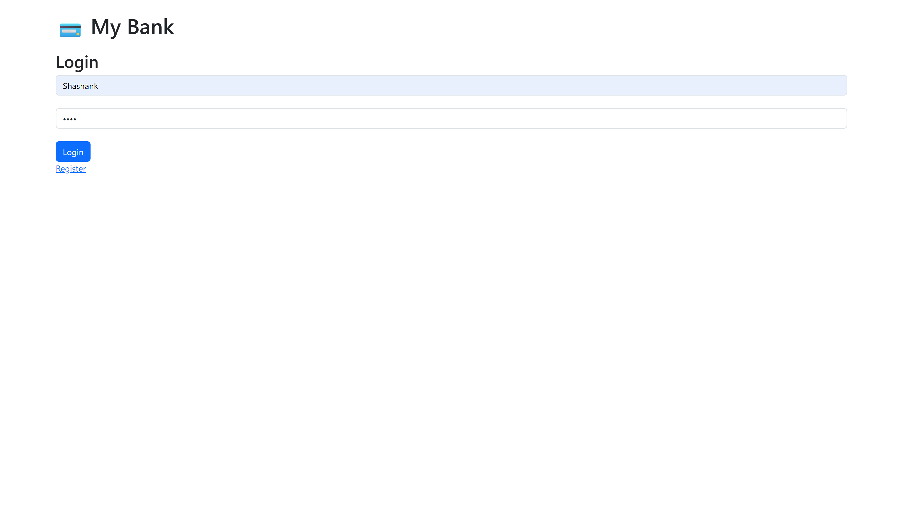
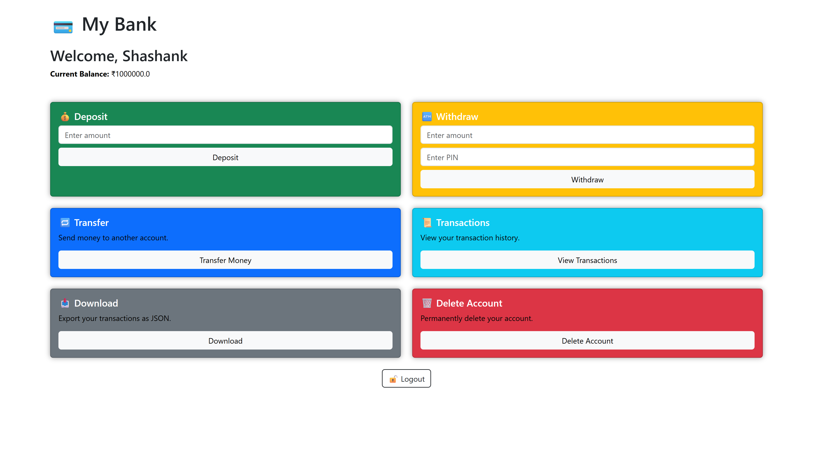

# 💳 Simple Banking Web App (Flask)

A lightweight and secure banking system built using Python Flask.  
This app allows users to register, log in, deposit and withdraw funds, transfer money, view transaction history, and delete their account securely.

---

## 🚀 Features

- 🔐 User Registration & Login (with PIN authentication)
- 💰 Deposit & Withdraw Funds
- 🔁 Transfer Between Accounts
- 📜 Transaction History & Download
- 🗑️ Secure Account Deletion with PIN
- 📦 JSON File-Based Storage

---

## 🖥️ Demo

Try it live: [https://your-app-name.onrender.com]((https://banking-app-wmj7.onrender.com/login))

---

